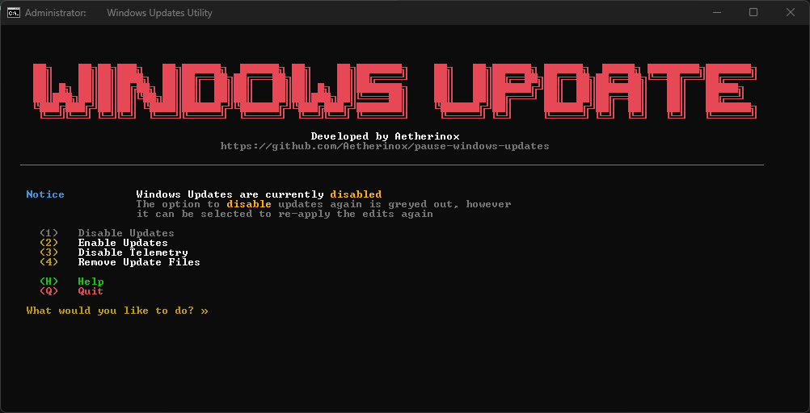
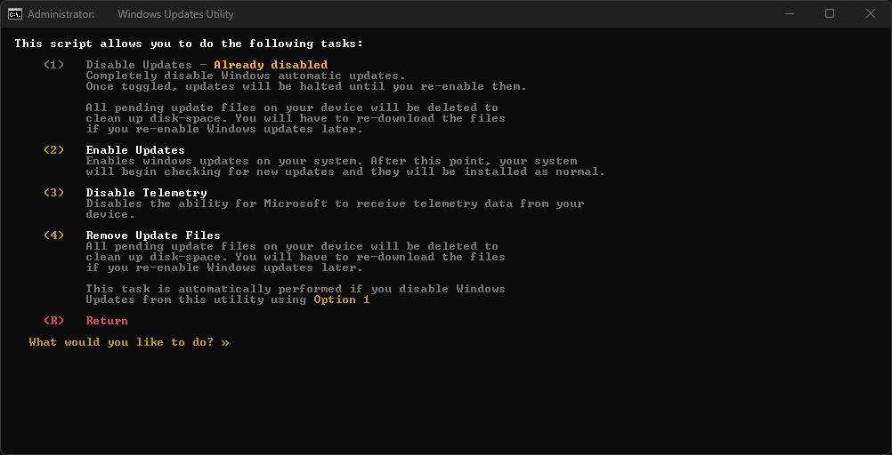
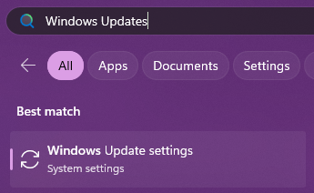
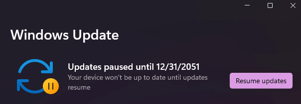
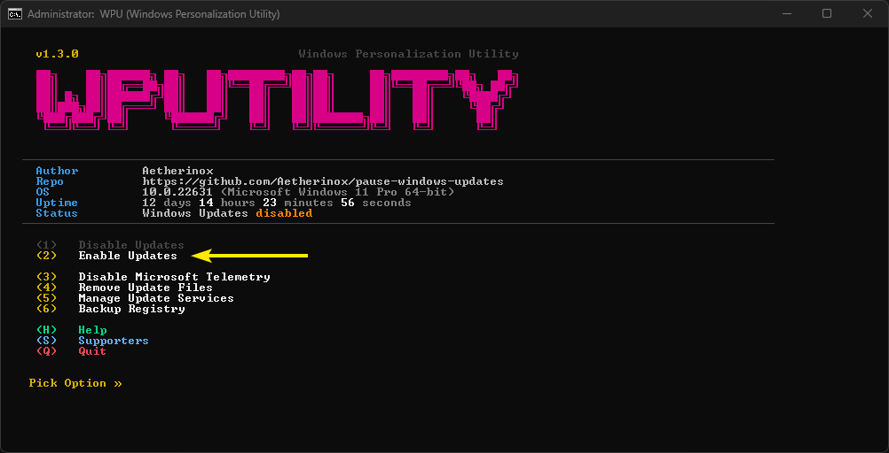

<div align="center">
<h6>No updates until 12-31-2051</h6>
<h1>♾️ Pause Windows Update ♾️</h1>

<br />

<p>A registry tweak and batch utility which allows you to pause Windows updates up until 12-31-2051.</p>

<br />

</div>

<div align="center">

<!-- prettier-ignore-start -->
[![Version][github-version-img]][github-version-uri]
[![Downloads][github-downloads-img]][github-downloads-uri]
[![Size][github-size-img]][github-size-img]
[![Last Commit][github-commit-img]][github-commit-img]
<!-- prettier-ignore-end -->

</div>

<br />

---

<br />

- [About](#about)
  - [Registry Scripts](#registry-scripts)
  - [All-in-one Batch Utility](#all-in-one-batch-utility)
- [Notice](#notice)
- [Install](#install)
  - [Registry Scripts](#registry-scripts-1)
  - [All-in-one Batch Utility](#all-in-one-batch-utility-1)
  - [Confirm](#confirm)
- [Re-enable Updates](#re-enable-updates)
  - [Option 1 (unpause.reg)](#option-1-unpausereg)
  - [Option 2 (manual)](#option-2-manual)
  - [Option 3 (batch utility)](#option-3-batch-utility)
- [Preview](#preview)
- [Contributors](#contributors)

<br />

---

<br />

## About

This repository provides two different ways to pause windows updates. 

The [All-In-One Batch method](#all-in-one-batch-utility) gives you a few more features that you can pick from in order to disable Windows Updates, as well as disabling Microsoft Telemetry. This method can also clean up any existing files on your machine that may be storing old Windows Updates and free up disk-space.

The [Registry Scripts method](#registry-scripts) only allows you to enable or disable windows updates.

<br />

You can pick which one you wish to use from the list below (pick one):

1. [Registry Scripts](#registry-scripts)
     - `windows-updates-pause.reg`
     - `windows-updates-unpause.reg`
2. [All-in-One Batch Utility](#all-in-one-batch-utility)
     - `windows-updates-utility.bat`

<br />

### Registry Scripts

If you decide to go with the **registry** method, download the `.reg` file, and then double-click on the file depending on if you want to pause or unpause windows updates.

<br />

<div align="center">

<p float="left">
  
</p>

</div>

<br />

### All-in-one Batch Utility

To use, double-click the batch `.bat` file. You will be presented and numerous options that you can choose from:

1. Enable Windows Updates
2. Disable Windows Updates
3. Disable Microsoft Telemetry
4. Remove Cached Update Files
5. Manage Update Services
     1. View Services Status
     2. Enable Services
     3. Disable Services

<div align="center">

<p float="left">
  
   
</p>

</div>

<br />

> [!NOTE]
> When launching the `.bat` file, you will be asked to allow the utility to have administrative permissions. Unfortunately, this script requires these permissions in order to change registry settings.
>
> If you do not feel comfortable with this, you may opt to use the [Registry Scripts method](#registry-scripts) listed above

<br />

---

<br />

## Notice

While this repository allows you to disable Windows Updates, we recommend you manually run Windows Updates every few months to ensure that your system has the latest patches. By completely refusing to install Windows Updates, you may be exposed to potential security vulnerabilities.

This script is meant to stop Windows from updating and then automatically restarting your system when you least expect it, and puts you back in control.

<br />

---

<br />

## Install

This repo contains two different ways you can disable Windows Updates:


1. [Registry Scripts](#registry-scripts)
2. [All-in-One Batch Utility](#all-in-one-batch-utility)

<br />

Head over to this repo's [Releases](https://github.com/Aetherinox/Windows-Update-Killer/releases) section and pick which file you need to get the job done. They are outlined below:

| <sup><sub>Filename</sub></sup> | <sup><sub>Method</sub></sup> | <sup><sub>Description</sub></sup> |
| --- | --- | --- |
| `windows-updates-utility.bat` | <sup><sub>Batch Utility | <sup><sub>Enable / Disable Windows Updates<br />Disable Microsoft Telemetry<br/>Clean Cached Update Files<br/>Manage Update Services</sub></sup> |
| `windows-updates-pause.reg` | <sup><sub>Registry Script</sub></sup> | <sup><sub>Disable Windows Updates until 2051</sub></sup> |
| `windows-updates-unpause.reg` | <sup><sub>Registry Script</sub></sup> | <sup><sub>Enable Windows Updates</sub></sup> |

<br />

### Registry Scripts

- Download the `.reg` file to your computer.
- Right click on the file and select `Open With`
  

- Select `Registry Editor`
- Click `Yes` when prompted if you're sure you wish to continue

<br />

> [!NOTE]
> If using the **Registry Scripts method**, depending on your machine's configuration, you may be able to double-click the `.reg` file and auto-install it.
>
> If you cannot do the above, right-click the file, select **Open With** and select **Registry Editor**.

<br />

### All-in-one Batch Utility

- Download the `.bat` file to your system.
- Double-click the file and Command Prompt or Powershell will launch.
- You will be prompted to give the script permission so that it can modify your registry, select **Yes**.
- Read the options in the menu, and select the option you want.

<br />

### Confirm

- In Windows, click `Start` -> `Run` -> type `control update` and press ENTER.
  - You can also access the Windows Update window by clicking your start menu, selecting **Run**, and typing:
   ```shell
    ms-settings:windowsupdate
   ```
- Near the `Pause Updates` section, if you see a dropdown box, select how long you want updates to pause for.
- Keep the scripts somewhere in case you need to reinstall / wipe your machine.

<br />

---

<br />

## Re-enable Updates

You can re-enable Windows updates by performing one of the following:

- Option 1 - [enable using unpause.reg](#option-1-unpausereg)
- Option 2 - [enable manually](#option-2-manual)
- Option 3 - [enable using batch `.bat` script](#option-3-batch-utility)

<br />

### Option 1 (unpause.reg)

This repository includes two scripts:
- `windows-updates-pause.reg`
- `windows-updates-unpause.reg`

<br />

Download and run the script `windows-updates-unpause.reg`. Windows updates will be re-activated, but you'll be able to re-pause updates whenever you want and for any duration.

<br />

### Option 2 (manual)

To start Windows updates once again, open your start menu, type `Windows Update Settings`.

<br />

<div align="center">

<p float="left">
  
</p>

</div>

<br />

At the top of the Windows Update interface, click **Resume Updates**.

<div align="center">

<p float="left">
  
</p>

</div>

<br />

To pause updates again, re-run the `.reg` file in this repo.

<br />

### Option 3 (batch utility)

To re-enable updates using the batch utility, double-click the `.bat` file.

When the options appear, select option `(2)   Enable Updates`

<div align="center">

<p float="left">
  
</p>

</div>

<br />

---

<br />

## Preview

<div align="center">

<p float="left">
  
</p>

</div>

<br />

## Contributors

<div align="center">


</div>

<br />
<br />

<!-- prettier-ignore-start -->
<!-- markdownlint-disable -->

<!-- BADGE > GENERAL -->
  [general-npmjs-uri]: https://npmjs.com
  [general-nodejs-uri]: https://nodejs.org
  [general-npmtrends-uri]: http://npmtrends.com/windows-update-killer

<!-- BADGE > VERSION > GITHUB -->
  [github-version-img]: https://img.shields.io/github/v/tag/Aetherinox/Windows-Update-Killer?logo=GitHub&label=Version&color=ba5225
  [github-version-uri]: https://github.com/Aetherinox/Windows-Update-Killer/releases

<!-- BADGE > VERSION > NPMJS -->
  [npm-version-img]: https://img.shields.io/npm/v/windows-update-killer?logo=npm&label=Version&color=ba5225
  [npm-version-uri]: https://npmjs.com/package/windows-update-killer

<!-- BADGE > VERSION > PYPI -->
  [pypi-version-img]: https://img.shields.io/pypi/v/windows-update-killer-plugin
  [pypi-version-uri]: https://pypi.org/project/windows-update-killer-plugin/

<!-- BADGE > LICENSE > MIT -->
  [license-mit-img]: https://img.shields.io/badge/MIT-FFF?logo=creativecommons&logoColor=FFFFFF&label=License&color=9d29a0
  [license-mit-uri]: https://github.com/Aetherinox/Windows-Update-Killer/blob/main/LICENSE

<!-- BADGE > GITHUB > DOWNLOAD COUNT -->
  [github-downloads-img]: https://img.shields.io/github/downloads/Aetherinox/Windows-Update-Killer/total?logo=github&logoColor=FFFFFF&label=Downloads&color=376892
  [github-downloads-uri]: https://github.com/Aetherinox/Windows-Update-Killer/releases

<!-- BADGE > NPMJS > DOWNLOAD COUNT -->
  [npmjs-downloads-img]: https://img.shields.io/npm/dw/%40aetherinox%2Fmkdocs-link-embeds?logo=npm&&label=Downloads&color=376892
  [npmjs-downloads-uri]: https://npmjs.com/package/windows-update-killer

<!-- BADGE > GITHUB > DOWNLOAD SIZE -->
  [github-size-img]: https://img.shields.io/github/repo-size/Aetherinox/Windows-Update-Killer?logo=github&label=Size&color=59702a
  [github-size-uri]: https://github.com/Aetherinox/Windows-Update-Killer/releases

<!-- BADGE > NPMJS > DOWNLOAD SIZE -->
  [npmjs-size-img]: https://img.shields.io/npm/unpacked-size/windows-update-killer/latest?logo=npm&label=Size&color=59702a
  [npmjs-size-uri]: https://npmjs.com/package/windows-update-killer

<!-- BADGE > CODECOV > COVERAGE -->
  [codecov-coverage-img]: https://img.shields.io/codecov/c/github/Aetherinox/Windows-Update-Killer?token=MPAVASGIOG&logo=codecov&logoColor=FFFFFF&label=Coverage&color=354b9e
  [codecov-coverage-uri]: https://codecov.io/github/Aetherinox/Windows-Update-Killer

<!-- BADGE > ALL CONTRIBUTORS -->
  [contribs-all-img]: https://img.shields.io/github/all-contributors/Aetherinox/Windows-Update-Killer?logo=contributorcovenant&color=de1f6f&label=contributors
  [contribs-all-uri]: https://github.com/all-contributors/all-contributors

<!-- BADGE > GITHUB > BUILD > NPM -->
  [github-build-img]: https://img.shields.io/github/actions/workflow/status/Aetherinox/Windows-Update-Killer/npm-release.yml?logo=github&logoColor=FFFFFF&label=Build&color=%23278b30
  [github-build-uri]: https://github.com/Aetherinox/Windows-Update-Killer/actions/workflows/npm-release.yml

<!-- BADGE > GITHUB > BUILD > Pypi -->
  [github-build-pypi-img]: https://img.shields.io/github/actions/workflow/status/Aetherinox/Windows-Update-Killer/release-pypi.yml?logo=github&logoColor=FFFFFF&label=Build&color=%23278b30
  [github-build-pypi-uri]: https://github.com/Aetherinox/Windows-Update-Killer/actions/workflows/pypi-release.yml

<!-- BADGE > GITHUB > TESTS -->
  [github-tests-img]: https://img.shields.io/github/actions/workflow/status/Aetherinox/Windows-Update-Killer/npm-tests.yml?logo=github&label=Tests&color=2c6488
  [github-tests-uri]: https://github.com/Aetherinox/Windows-Update-Killer/actions/workflows/npm-tests.yml

<!-- BADGE > GITHUB > COMMIT -->
  [github-commit-img]: https://img.shields.io/github/last-commit/Aetherinox/Windows-Update-Killer?logo=conventionalcommits&logoColor=FFFFFF&label=Last%20Commit&color=313131
  [github-commit-uri]: https://github.com/Aetherinox/Windows-Update-Killer/commits/main/

<!-- prettier-ignore-end -->
<!-- markdownlint-restore -->
