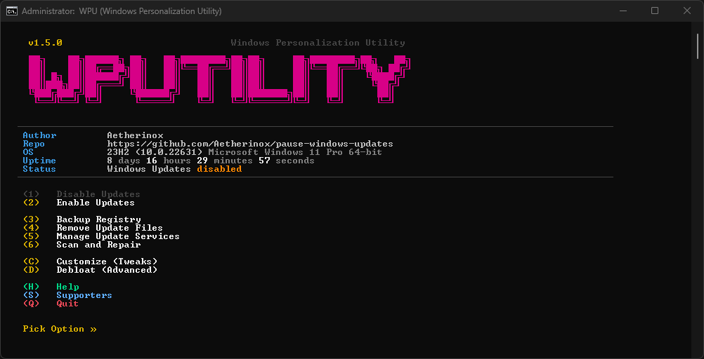
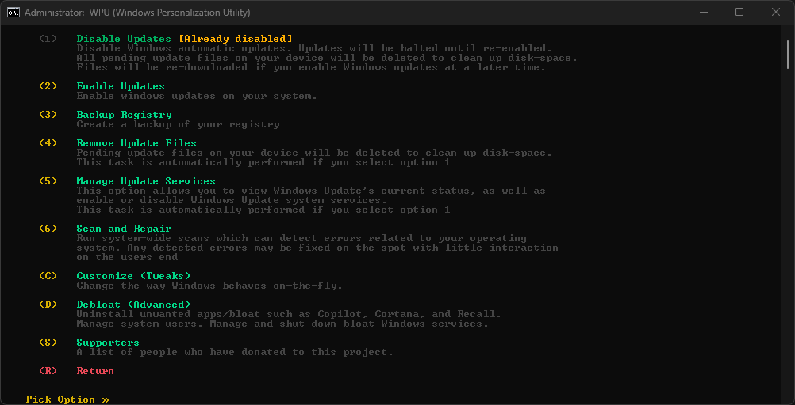
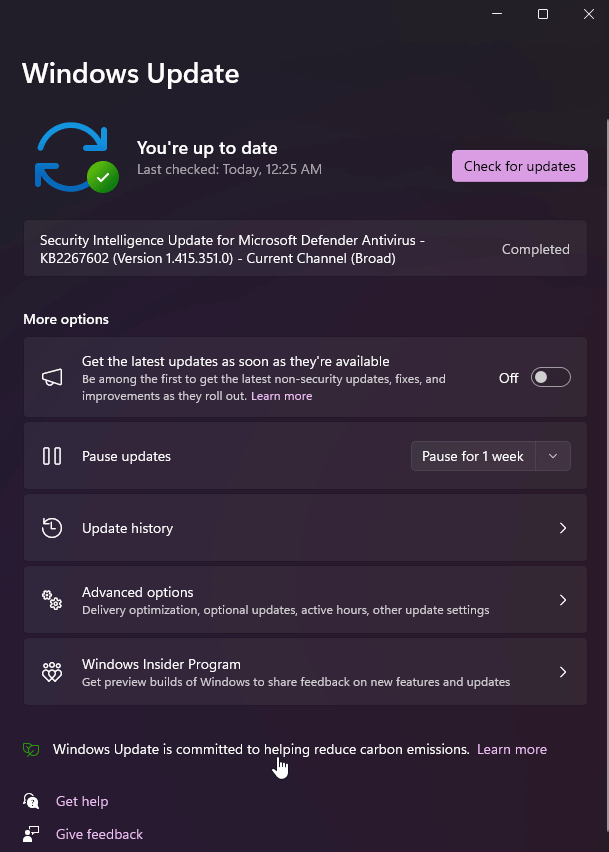

<div align="center">
<h6>No updates until 12-31-2051; take back your device</h6>
<h1>♾️ Windows Personalization Utility ♾️</h1>

<br />

<p>Windows Personalization Utility (WPU) - A registry tweak and batch utility which allows you to pause Windows updates up until 12-31-2051 and take back the privacy on your system.</p>

<br />

</div>

<div align="center">

<!-- prettier-ignore-start -->
[![Version][github-version-img]][github-version-uri]
[![Downloads][github-downloads-img]][github-downloads-uri]
[![Size][github-size-img]][github-size-img]
[![Last Commit][github-commit-img]][github-commit-img]
<!-- prettier-ignore-end -->

</div>

<br />

---

<br />

- [About](#about)
- [Notice](#notice)
- [Install](#install)
  - [WP Utility](#wp-utility)
  - [Registry Scripts](#registry-scripts)
- [Confirm Updates Enabled/Disabled](#confirm-updates-enableddisabled)
- [Re-enable Updates](#re-enable-updates)
  - [Option 1 (unpause.reg)](#option-1-unpausereg)
  - [Option 2 (manual)](#option-2-manual)
  - [Option 3 (batch utility)](#option-3-batch-utility)
- [Frequently Asked Questions](#frequently-asked-questions)
  - [Is It Safe?](#is-it-safe)
  - [Is It Free?](#is-it-free)
  - [Contributing](#contributing)
- [Preview](#preview)
- [Contributors ✨](#contributors-)

<br />

---

<br />

## About

Formerly known as a simply registry tweak to disable Microsoft Windows updates, this repository has grown into a utility known as **WPU** _(Windows Personalization Utility)_; a more complete solution for Windows users. To get an idea of how the utility works, check out Youtube videos this project was reviewed on:

- [Britec09 - Control Windows Updates With One Click](https://youtube.com/watch?v=vNM6AS9hTIs)
- [SCPC Informática - Bloquea Updates en 1 Click](https://youtube.com/watch?v=Cikj2DS9PhU)

<br />

If you are here to simply disable Windows Updates; this repository provides two different options you can pick from:

[Option 1: WP Utility](#wp-utility):

- Disable / Enable Windows Updates
- Delete / clean up lingering Windows Update files to increase disk-space
- Backup your entire system registry
- Remove Windows telemetry and tracking
- Uninstall Windows "crapware / bloatware" applications
  - Microsoft.Teams
  - Microsoft.BingSearch
  - Microsoft.BingHealthAndFitness
  - Microsoft.BingFoodAndDrink
  - Microsoft.WindowsFeedback
  - Microsoft.BingTranslator
  - Microsoft.BingTravel
  - Microsoft.Copilot
  - Microsoft.Edge
  - <sup><sub>**Many more**</sub></sup>
- Install / Uninstall apps such as:
  - Chrome
  - Cortana
  - DuckDuckGo
  - Firefox
  - Microsoft .NET SDK
  - Microsoft Edge
  - Microsoft IronPython
  - Microsoft OneDrive
  - Microsoft OpenSSH
  - Microsoft Visual C++
  - Opera
  - Powershell 7
  - Tor Browser
  - <sup><sub>**Many more**</sub></sup>
- Requires elevated admin permissions to run
- Available by downloading the files on our [Releases](https://github.com/Aetherinox/pause-windows-updates/releases/latest) page:
    - `wputility.bat`


<br />

[Option 2: Registry Scripts](#registry-scripts)

- Disable / Enable Windows Updates
- Requires no elevated permissions
- Available by downloading the files on our [Releases](https://github.com/Aetherinox/pause-windows-updates/releases/latest) page:
    - `windows-updates-pause.reg`
    - `windows-updates-unpause.reg`

</div>

<br />

---

<br />

## Notice

While this repository allows you to disable Windows Updates, we recommend you manually run Windows Updates every few months to ensure that your system has the latest patches. By completely refusing to install Windows Updates, you may be exposed to potential security vulnerabilities.

This script is meant to stop Windows from updating and then automatically restarting your system when you least expect it, and puts you back in control.

<br />

---

<br />

## Install

This repo contains two different ways you can disable Windows Updates:


1. [WPUtility](#wp-utility)
2. [Registry Scripts](#registry-scripts)

<br />

Head over to this repo's [Releases](https://github.com/Aetherinox/Windows-Update-Killer/releases) section and pick which file you need to get the job done. They are outlined below:

| <sup><sub>Filename</sub></sup> | <sup><sub>Method</sub></sup> | <sup><sub>Description</sub></sup> |
| --- | --- | --- |
| `wputility.bat` | Batch Utility | Enable / Disable Windows Updates<br />Disable Microsoft Telemetry<br/>Clean Cached Update Files<br/>Manage Update Services<br/>Backup system registry |
| `windows-updates-pause.reg` | Registry Script | Disable Windows Updates until 2051 |
| `windows-updates-unpause.reg` | Registry Script | Enable Windows Updates |

<br />
<br />

### WP Utility

- Download the `.bat` file to your computer from the bottom of our [Releases](https://github.com/Aetherinox/pause-windows-updates/releases/latest) page.
- Double-click the file and Command Prompt or Powershell will launch.

<br />

> [!NOTE]
> When launching the `.bat` file, you will be asked to allow the utility to have administrative permissions. Unfortunately, this script requires these permissions in order to change registry settings.
>
> If you do not feel comfortable with this, you may opt to use the [Registry Scripts method](#registry-scripts) listed above

<br />

- You will be prompted to give the script permission so that it can modify your registry, select **Yes**.
- Read the options in the menu, and select the option you want. You will be presented and numerous options that you can choose from:
  1. Enable Windows Updates
  2. Disable Windows Updates
  3. Disable Microsoft Telemetry
  4. Remove Cached Update Files
  5. Manage Update Services
      1. View Services Status
      2. Enable Services
      3. Disable Services
  6. Backup Registry
  7. Advanced
    - Enable/Disable Cortana
    - Uninstall Crapware
      - Microsoft.Teams
      - Microsoft.BingSearch
      - Microsoft.BingHealthAndFitness
      - Microsoft.BingFoodAndDrink
      - Microsoft.WindowsFeedback
      - Microsoft.BingTranslator
      - Microsoft.BingTravel
      - Microsoft.Copilot
      - Microsoft.Edge
      - <sup><sub>**Many more**</sub></sup>
    - Install Apps
      - Install Powershell 7.x
      - Install PowerToys

<br />

<div align="center">

<p float="left">
  
   
</p>

</div>

<br />
<br />
<br />

<br />

### Registry Scripts

- Download the `.reg` file to your computer from the bottom of our [Releases](https://github.com/Aetherinox/pause-windows-updates/releases/latest) page.
- Right click on the file and select `Open With`
  

- Select `Registry Editor`
- Click `Yes` when prompted if you're sure you wish to continue

<br />

> [!NOTE]
> If using the **Registry Scripts method**, depending on your machine's configuration, you may be able to double-click the `.reg` file and auto-install it.
>
> If you cannot do the above, right-click the file, select **Open With** and select **Registry Editor**.


<br />

---

<br />

## Confirm Updates Enabled/Disabled

To see whether or not Windows Updates are currently enabled or disabled:

- In Windows, click `Start` -> `Run` -> type `control update` and press ENTER.
  - You can also access the Windows Update window by clicking your start menu, selecting **Run**, and typing:
   ```shell
    ms-settings:windowsupdate
   ```
- Near the `Pause Updates` section, if you see a dropdown box, select how long you want updates to pause for.
- Keep the scripts somewhere in case you need to reinstall / wipe your machine.

Our `wpUtility.bat` script also tells you if Windows Updates are enabled or disabled when you launch the utility on your system.

<br />

---

<br />

## Re-enable Updates

You can re-enable Windows updates by performing one of the following:

- Option 1 - [Enable using unpause.reg](#option-1-unpausereg)
- Option 2 - [Enable manually](#option-2-manual)
- Option 3 - [Enable using batch `.bat` script](#option-3-batch-utility)

<br />
<br />

### Option 1 (unpause.reg)

This repository includes two scripts:
- `windows-updates-pause.reg`
- `windows-updates-unpause.reg`

<br />

Download and run the script `windows-updates-unpause.reg`. Windows updates will be re-activated, but you'll be able to re-pause updates whenever you want and for any duration.

<br />
<br />

### Option 2 (manual)

To start Windows updates once again, open your start menu, type `Windows Update Settings`.

<br />

<div align="center">

<p float="left">
  
</p>

</div>

<br />

At the top of the Windows Update interface, click **Resume Updates**.

<div align="center">

<p float="left">
  
</p>

</div>

<br />

To pause updates again, re-run the `.reg` file in this repo.

<br />
<br />

### Option 3 (batch utility)

To re-enable updates using the batch utility, double-click the `.bat` file.

When the options appear, select option `(2)   Enable Updates`

<div align="center">

<p float="left">
  
</p>

</div>

<br />

---

<br />

## Frequently Asked Questions

Have a question? It may be answered here:

<br />

### Is It Safe?

Yes. This repository contains two ways that you can enable / disable updates; via a `.bat batch ` file, or a `.reg registry` file. We picked these languages because the runtime scripts do not require being compiled and the source code is freely available to review. You can open any of the scripts within something as simple as notepad and go through the list of changes being made.

The downside to .bat files is that they require elevated permissions in order to do everything the script has to offer. Running scripts with elevated permissions can be dangerous if you are unaware of what the script does, and the potential for malicious code to be injected. 

This is why we offer the `.reg` registry alternative for users who do not wish to grant elevated permissions to a script. The downside to the `.reg` file is that it does not do nearly as much as the .bat file. Both will enable / disable Windows Updates, but the .bat file contains a lot more functionality if you want to take a deeper dive into what your system has. The choice is yours.

The point of this project is to make life easier, and re-gain at least some minimal amount of control with your system. The scripts do not contain anything other than what is described in this documentation, and it will stay that way.

<br />

### Is It Free?

The great thing about Github is that you are provided with the source code to a project. No paywalls, no one-time payments, just a free utility that you can do as you wish. We will not charge for this app. We do accept donations to help with development, but that is completely optional. If not, hey, that's fine. Continue to enjoy the script without limitations.

<br />

### Contributing

We are always willing to accept new contributions, however, the code will be vetted before it is pushed to the public. Contributions shall not include functionality which is unrelated to Microsoft Windows, or Microsoft applications. New features must give the user the ability to opt in by choice, and not have it forced upon them, and new features shall be disabled by default and only enabled after the user has consented to such a change.

<br />

---

<br />

## Preview

<div align="center">

<p float="left">
  
</p>

</div>

<br />

---

<br />

## Contributors ✨

We are always looking for contributors. If you feel that you can provide something useful to Gistr, then we'd love to review your suggestion. Before submitting your contribution, please review the following resources:

- [Pull Request Procedure](.github/PULL_REQUEST_TEMPLATE.md)
- [Contributor Policy](CONTRIBUTING.md)

<br />

Want to help but can't write code?

- Review [active questions by our community](https://github.com/Aetherinox/pause-windows-updates/labels/❔%20Question) and answer the ones you know.

<br />

<div align="center">


</div>

<br />

The following people have helped get this project going:

<br />

<div align="center">

<!-- ALL-CONTRIBUTORS-BADGE:START - Do not remove or modify this section -->
[![Contributors][contribs-all-img]](#contributors-)
<!-- ALL-CONTRIBUTORS-BADGE:END -->

<!-- ALL-CONTRIBUTORS-LIST:START - Do not remove or modify this section -->
<!-- prettier-ignore-start -->
<!-- markdownlint-disable -->
<table>
  <tbody>
    <tr>
      <td align="center" valign="top"><a href="https://github.com/Aetherinox"><br /><sub><b>Aetherinox</b></sub></a><br /><a href="https://github.com/Aetherinox/pause-windows-updates/commits?author=Aetherinox" title="Code">💻</a> <a href="#projectManagement-Aetherinox" title="Project Management">📆</a> <a href="#fundingFinding-Aetherinox" title="Funding Finding">🔍</a></td>
      <td align="center" valign="top"><a href="https://github.com/kenshyura"><br /><sub><b>kenshyura</b></sub></a><br /><a href="https://github.com/Aetherinox/pause-windows-updates/commits?author=kenshyura" title="Code">💻</a></td>
    </tr>
  </tbody>
</table>
</div>
<!-- markdownlint-restore -->
<!-- prettier-ignore-end -->
<!-- ALL-CONTRIBUTORS-LIST:END -->

<!-- prettier-ignore-start -->
<!-- markdownlint-disable -->

<!-- BADGE > GENERAL -->
  [general-npmjs-uri]: https://npmjs.com
  [general-nodejs-uri]: https://nodejs.org
  [general-npmtrends-uri]: http://npmtrends.com/windows-update-killer

<!-- BADGE > VERSION > GITHUB -->
  [github-version-img]: https://img.shields.io/github/v/tag/Aetherinox/Windows-Update-Killer?logo=GitHub&label=Version&color=ba5225
  [github-version-uri]: https://github.com/Aetherinox/Windows-Update-Killer/releases

<!-- BADGE > VERSION > NPMJS -->
  [npm-version-img]: https://img.shields.io/npm/v/windows-update-killer?logo=npm&label=Version&color=ba5225
  [npm-version-uri]: https://npmjs.com/package/windows-update-killer

<!-- BADGE > VERSION > PYPI -->
  [pypi-version-img]: https://img.shields.io/pypi/v/windows-update-killer-plugin
  [pypi-version-uri]: https://pypi.org/project/windows-update-killer-plugin/

<!-- BADGE > LICENSE > MIT -->
  [license-mit-img]: https://img.shields.io/badge/MIT-FFF?logo=creativecommons&logoColor=FFFFFF&label=License&color=9d29a0
  [license-mit-uri]: https://github.com/Aetherinox/Windows-Update-Killer/blob/main/LICENSE

<!-- BADGE > GITHUB > DOWNLOAD COUNT -->
  [github-downloads-img]: https://img.shields.io/github/downloads/Aetherinox/Windows-Update-Killer/total?logo=github&logoColor=FFFFFF&label=Downloads&color=376892
  [github-downloads-uri]: https://github.com/Aetherinox/Windows-Update-Killer/releases

<!-- BADGE > NPMJS > DOWNLOAD COUNT -->
  [npmjs-downloads-img]: https://img.shields.io/npm/dw/%40aetherinox%2Fmkdocs-link-embeds?logo=npm&&label=Downloads&color=376892
  [npmjs-downloads-uri]: https://npmjs.com/package/windows-update-killer

<!-- BADGE > GITHUB > DOWNLOAD SIZE -->
  [github-size-img]: https://img.shields.io/github/repo-size/Aetherinox/Windows-Update-Killer?logo=github&label=Size&color=59702a
  [github-size-uri]: https://github.com/Aetherinox/Windows-Update-Killer/releases

<!-- BADGE > NPMJS > DOWNLOAD SIZE -->
  [npmjs-size-img]: https://img.shields.io/npm/unpacked-size/windows-update-killer/latest?logo=npm&label=Size&color=59702a
  [npmjs-size-uri]: https://npmjs.com/package/windows-update-killer

<!-- BADGE > CODECOV > COVERAGE -->
  [codecov-coverage-img]: https://img.shields.io/codecov/c/github/Aetherinox/Windows-Update-Killer?token=MPAVASGIOG&logo=codecov&logoColor=FFFFFF&label=Coverage&color=354b9e
  [codecov-coverage-uri]: https://codecov.io/github/Aetherinox/Windows-Update-Killer

<!-- BADGE > ALL CONTRIBUTORS -->
  [contribs-all-img]: https://img.shields.io/github/all-contributors/Aetherinox/Windows-Update-Killer?logo=contributorcovenant&color=de1f6f&label=contributors
  [contribs-all-uri]: https://github.com/all-contributors/all-contributors

<!-- BADGE > GITHUB > BUILD > NPM -->
  [github-build-img]: https://img.shields.io/github/actions/workflow/status/Aetherinox/Windows-Update-Killer/npm-release.yml?logo=github&logoColor=FFFFFF&label=Build&color=%23278b30
  [github-build-uri]: https://github.com/Aetherinox/Windows-Update-Killer/actions/workflows/npm-release.yml

<!-- BADGE > GITHUB > BUILD > Pypi -->
  [github-build-pypi-img]: https://img.shields.io/github/actions/workflow/status/Aetherinox/Windows-Update-Killer/release-pypi.yml?logo=github&logoColor=FFFFFF&label=Build&color=%23278b30
  [github-build-pypi-uri]: https://github.com/Aetherinox/Windows-Update-Killer/actions/workflows/pypi-release.yml

<!-- BADGE > GITHUB > TESTS -->
  [github-tests-img]: https://img.shields.io/github/actions/workflow/status/Aetherinox/Windows-Update-Killer/npm-tests.yml?logo=github&label=Tests&color=2c6488
  [github-tests-uri]: https://github.com/Aetherinox/Windows-Update-Killer/actions/workflows/npm-tests.yml

<!-- BADGE > GITHUB > COMMIT -->
  [github-commit-img]: https://img.shields.io/github/last-commit/Aetherinox/Windows-Update-Killer?logo=conventionalcommits&logoColor=FFFFFF&label=Last%20Commit&color=313131
  [github-commit-uri]: https://github.com/Aetherinox/Windows-Update-Killer/commits/main/

<!-- prettier-ignore-end -->
<!-- markdownlint-restore -->
